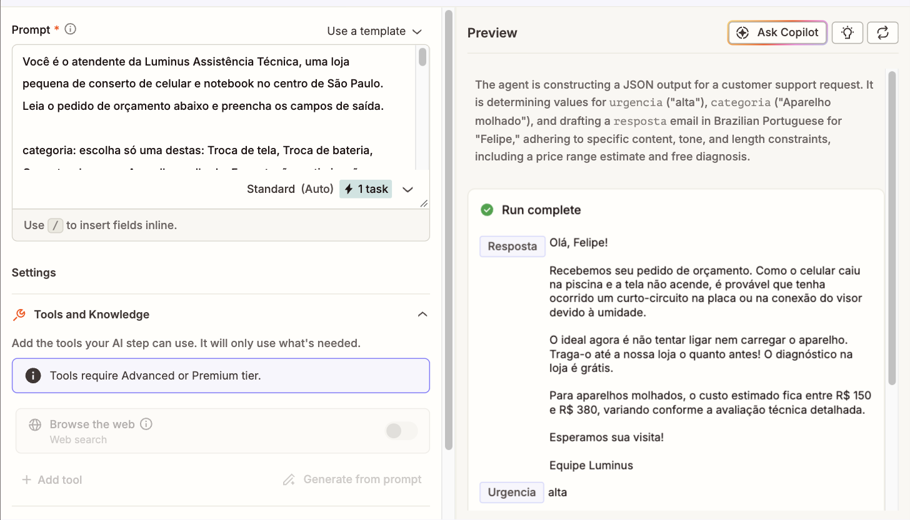
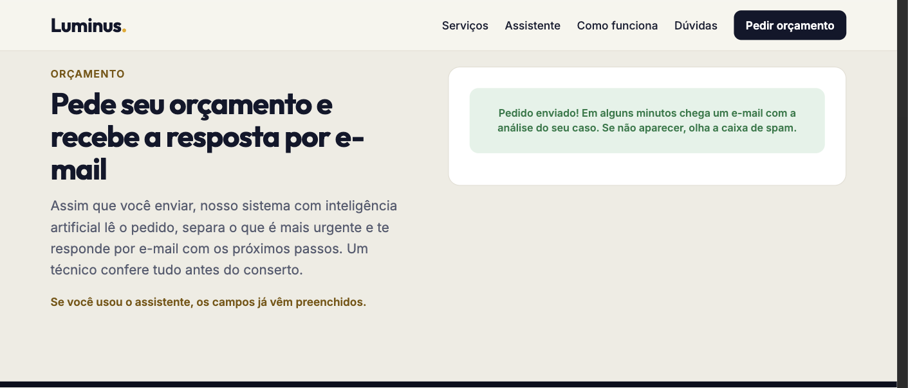
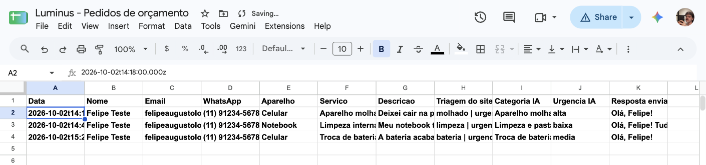
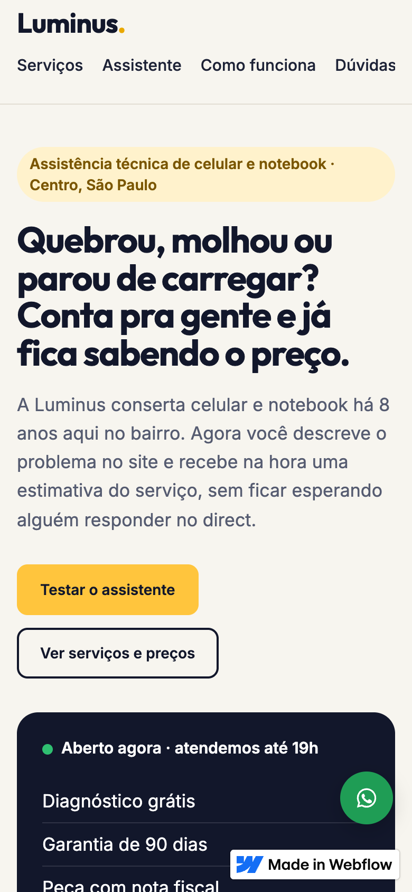
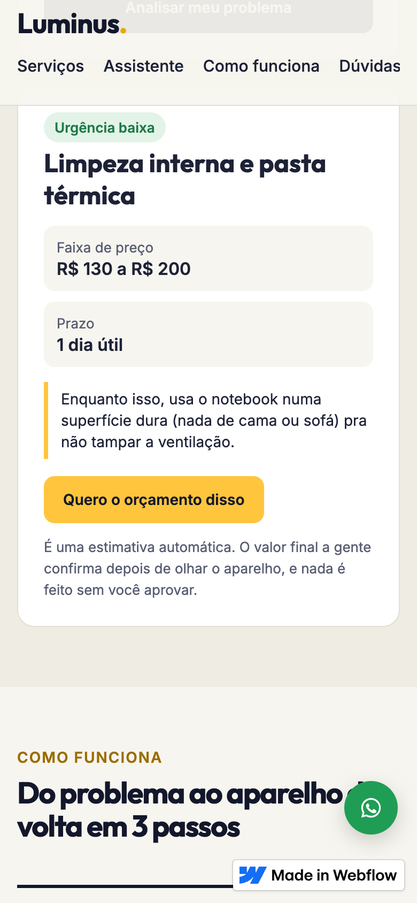
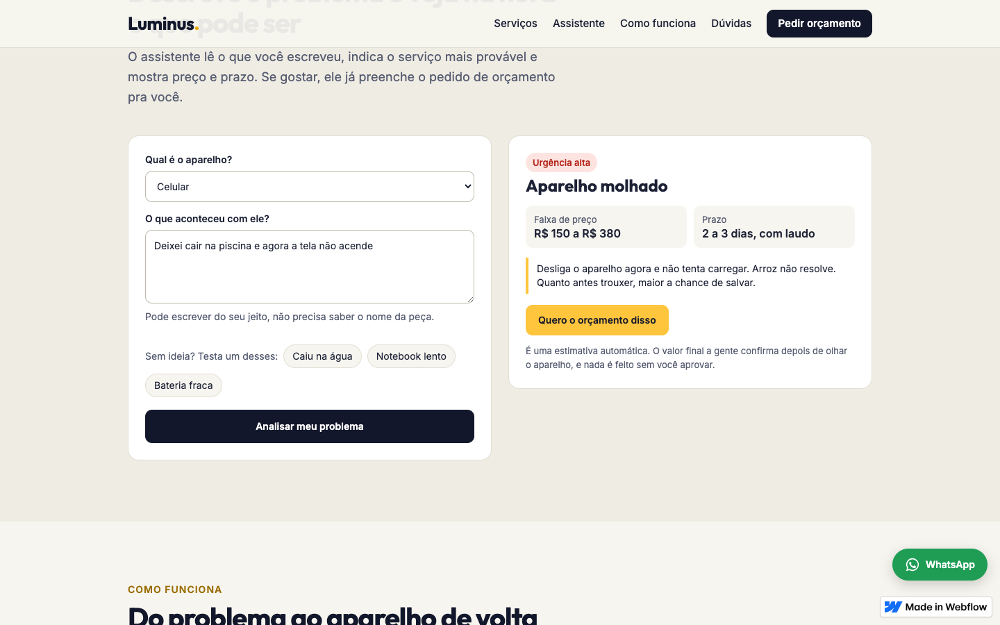
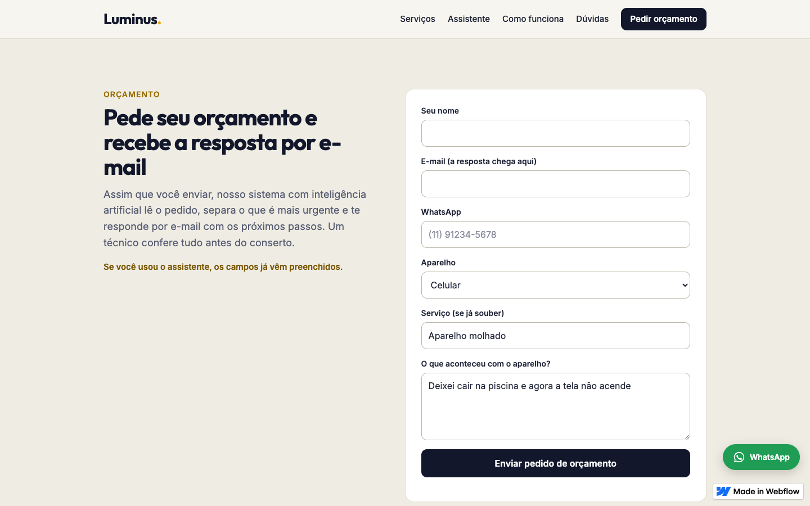
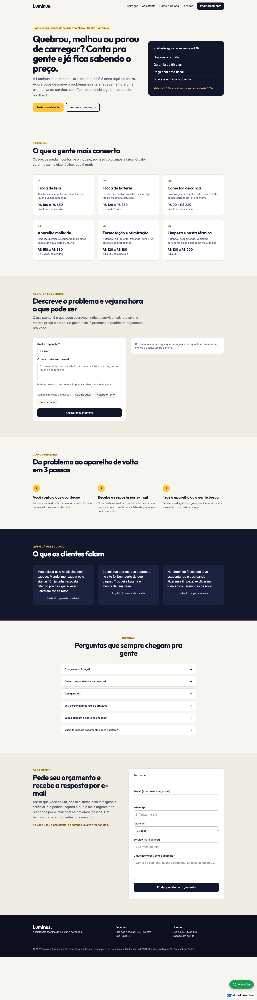
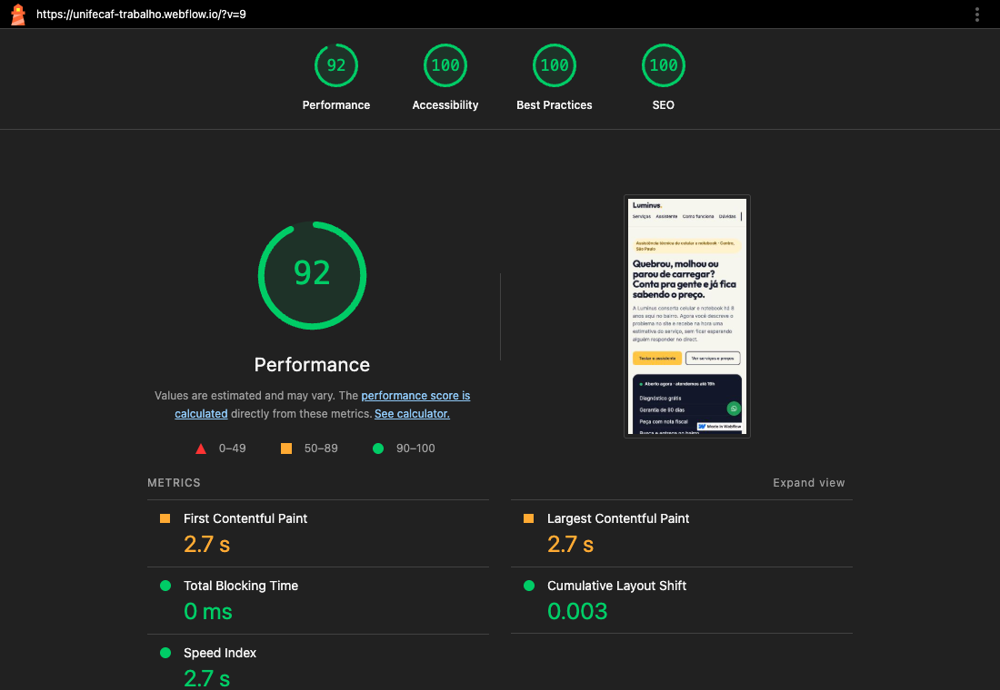

# Luminus Assistência Técnica

Eu fiz este site no Webflow para uma assistência técnica de celular e notebook, que é uma empresa fictícia. Usei código próprio em HTML, CSS e JavaScript e também criei uma automação com IA no Zapier.

Este é o trabalho da disciplina **Padrões Web para No Code e Low Code** (UniFECAF).  
Aluno: Felipe Augusto Camargo Laosa

- Site publicado: https://unifecaf-trabalho.webflow.io
- Vídeo pitch: https://www.youtube.com/watch?v=hNakCIi26gY


## O problema

Para este trabalho, imaginei a Luminus como uma loja pequena de bairro que só tinha Instagram. Os clientes sempre mandavam mensagens perguntando a mesma coisa, como "quanto fica pra trocar a tela?" e "vocês consertam notebook?". Com isso, o dono passava boa parte do dia respondendo direct. Quando alguém não recebia uma resposta rápida, acabava procurando outra loja.

Minha ideia foi criar um site que respondesse as dúvidas mais básicas na hora e organizasse os pedidos de orçamento sozinho. Eu também quis fazer isso sem depender de um programador fixo e sem gastar com servidor.

## O que o site faz

- Mostra os 6 serviços principais com faixa de preço e prazo
- **Assistente de triagem**: a pessoa escreve o problema do jeito dela, como "deixei cair na piscina", e o site mostra na hora qual serviço pode ser, quanto custa mais ou menos, o prazo, a urgência e uma dica do que fazer agora
- Botão "Quero o orçamento disso", que leva para o formulário com os campos já preenchidos
- Formulário de orçamento que dispara uma automação: a IA do Zapier lê o pedido, classifica a urgência, escreve uma resposta e manda por e-mail para o cliente, enquanto o pedido vai para uma planilha
- Mostra se a loja está aberta ou fechada no momento, usando o horário de Brasília
- Perguntas frequentes que abrem e fecham
- Botão flutuante do WhatsApp com mensagem pronta
- Layout que funciona no celular, tablet e computador

## Tecnologias e ferramentas

| Ferramenta | Pra que usei |
|---|---|
| Webflow (plano grátis) | Estrutura das páginas, estilos, formulário nativo e publicação |
| HTML | Assistente, perguntas frequentes (`<details>`), campos extras do formulário |
| CSS | Variáveis de cor, animações, foco visível, ajustes de responsividade |
| JavaScript | Lógica do assistente, status aberto/fechado, máscara de telefone, animação ao rolar, botão do WhatsApp |
| Zapier (Webhooks + AI by Zapier) | Automação que roda quando chega um pedido |
| AI by Zapier | Lê o pedido, classifica e escreve a resposta pro cliente |
| Google Sheets | Guarda todos os pedidos |
| Gmail | Envia a resposta automática |

## Personalizações com código

O Webflow monta a estrutura visual, como seções, cards, textos, menu, rodapé e formulário. A partir dessa estrutura, eu coloquei 5 blocos de código (Code Embed), que estão na pasta [`codigo-personalizado/`](codigo-personalizado):

| Arquivo | Onde fica | O que faz |
|---|---|---|
| `1-estilos-globais.html` | começo da página | Variáveis CSS com as cores da marca, fonte, foco visível no teclado, link "pular para o conteúdo", animação de entrada com `@keyframes`, respeita `prefers-reduced-motion`, coloca `lang="pt-BR"` |
| `2-assistente.html` | seção Assistente | Formulário do assistente + lógica em JS que normaliza o texto (tira acento), procura palavras-chave, dá pontos pra cada serviço e decide a urgência. O resultado aparece numa área com `aria-live` pra leitor de tela anunciar |
| `3-duvidas.html` | seção Dúvidas | Perguntas com `<details>` e `<summary>`, que já funcionam no teclado sem JS |
| `4-scripts-gerais.html` | fim da página | Status aberto/fechado com `Intl.DateTimeFormat`, animação com `IntersectionObserver`, botão do WhatsApp, máscara do telefone, ano no rodapé |
| `5-campos-formulario.html` | dentro do formulário | Campos WhatsApp, Aparelho, Serviço e Descrição feitos na mão, mais um campo escondido com a triagem do assistente |

Algumas partes precisaram ser feitas em código porque o Webflow não permitia fazer isso no plano grátis, ou só oferecia a opção no plano pago:

- O plano grátis não deixa colocar código no `<head>` nem mudar o idioma da página, então eu coloquei isso no primeiro embed
- O painel de estilos não aceita `@keyframes` nem `prefers-reduced-motion`
- Os campos que eu criei pelo painel apareciam no site com o nome "Field 3" e o texto "Example Text", então refiz esses campos em HTML dentro do formulário

## Recurso inteligente

Eu dividi o recurso inteligente em duas partes.

**1. Triagem no próprio site (JavaScript).** Ela funciona na hora, sem depender de uma internet rápida. Testei com 10 frases diferentes e o assistente acertou as 10. Antes disso, precisei corrigir o caso de "estufou", que no começo não era reconhecido.

**2. Automação com IA (Zapier).** Quando alguém envia o formulário:

```
Webflow (webhook do formulário) → Webhooks by Zapier → AI by Zapier (classifica e escreve a resposta)
   → Google Sheets (salva o pedido) → Gmail (manda a resposta pro cliente)
```

No passo de IA, eu defini três campos de saída (`categoria`, `urgencia` e `resposta`). Assim, a IA já devolve cada informação separada, e os próximos passos conseguem usar esses dados diretamente.

O passo a passo completo, com o prompt, está em [`automacao-zapier.md`](automacao-zapier.md).

No teste, a IA classificou "Deixei cair na piscina e agora a tela não acende" como aparelho molhado com urgência alta e escreveu o e-mail abaixo. O pedido também foi salvo na planilha junto com a classificação.






_A linha 4 veio de um pedido real feito no site: o assistente indicou troca de bateria e a IA do Zapier marcou urgência média._

Eu cheguei a pensar em chamar uma IA diretamente pelo JavaScript do site. O problema é que a chave da API ficaria no código-fonte da página e qualquer pessoa poderia vê-la. Com a IA rodando dentro do Zapier, a chave não fica exposta.

## Prints

| | |
|---|---|
|  |  |
| Página inicial no celular | Assistente no celular |


_Assistente classificando "Deixei cair na piscina e agora a tela não acende"_


_Formulário já preenchido depois de clicar em "Quero o orçamento disso"_



## Como testar

1. Abra https://unifecaf-trabalho.webflow.io
2. Vá em **Assistente** e escreva um problema, por exemplo:
   - "a tela trincou e tem listras verdes"
   - "meu notebook tá lento e esquentando"
   - "a bateria estufou"
   - ou clique em um dos exemplos prontos
3. Clique em **Quero o orçamento disso** e veja o formulário preenchido
4. Coloque nome, e-mail de verdade e WhatsApp e envie
5. Em alguns minutos chega um e-mail com a resposta escrita pela IA, mas ele pode cair no spam

Também dá pra testar a responsividade diminuindo a janela do navegador ou abrindo o site no celular. Para testar a acessibilidade, dá para navegar usando somente a tecla Tab.

## Lighthouse (celular)

Eu rodei o Lighthouse no site publicado, simulando um celular. Na primeira vez, a acessibilidade ficou em 97 por causa do contraste do texto amarelo pequeno em cima dos títulos. Eu escureci a cor, de `#9a6d00` para `#7a5600`, e rodei o teste novamente:

| Desempenho | Acessibilidade | Boas práticas | SEO |
|---|---|---|---|
| 92 | 100 | 100 | 100 |



## Estrutura da pasta

```
smart-web-experience/
├── README.md
├── automacao-zapier.md         passo a passo do Zap
├── codigo-personalizado/       os 5 embeds colocados no Webflow
├── prints/                     evidências
└── teste-local.html            página que usei pra testar o código antes de subir
```

## Limitações

- Eu usei uma empresa fictícia, então os preços, depoimentos e o endereço são inventados
- O plano grátis do Webflow mostra o selo "Made in Webflow" e tem limite de 50 envios de formulário
- O gatilho pronto "Webflow" do Zapier não puxava os campos que fiz em HTML, então troquei por um webhook do Webflow ligado no "Webhooks by Zapier"
- A triagem do site funciona por palavras-chave, então, se a pessoa escrever algo muito diferente, o resultado cai em "Diagnóstico na loja"
- O botão do WhatsApp não tem número porque a loja não existe
